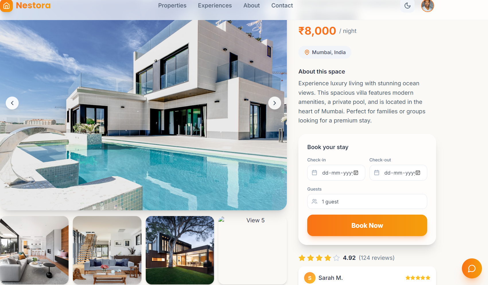
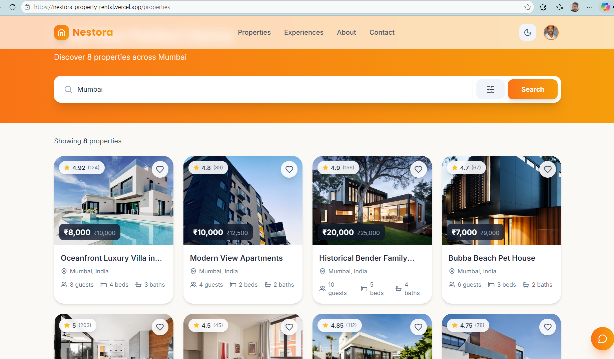
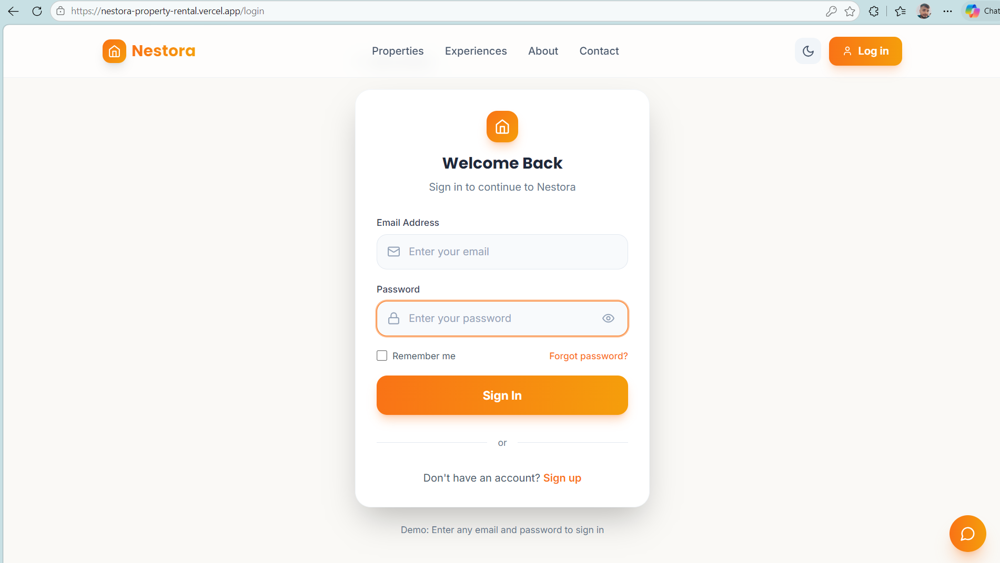

# Nestora – House Rent Application (MERN Stack)

Nestora is a full-stack property rental platform that allows users to search, explore, and book rental properties easily. The platform enables tenants to browse available homes while allowing landlords and agents to manage listings efficiently.

Built using the **MERN Stack (MongoDB, Express.js, React, Node.js)**, the application includes authentication, property listings, booking workflows, reviews, and real-time chat functionality.

---

# Live Demo

https://nestora-property-rental.vercel.app/

---

# Features

### User Authentication

* Secure login and registration using JWT authentication
* Protected routes and user session handling

### Role-Based Access

The platform supports three types of users:

* **Tenant** – Browse and book properties
* **Landlord** – Manage property listings
* **Agent** – Manage properties for landlords

### Property Management

* Add, edit, and delete property listings
* Upload property images
* View detailed property information

### Property Search

Users can filter properties by:

* Location
* Price range
* Bedrooms
* Bathrooms
* Property type

### Booking System

* Tenants can request bookings
* Landlords or agents can approve or reject requests

### Real-Time Messaging

* Chat system built using Socket.io
* Direct communication between tenants and property owners

### Reviews and Ratings

* Users can leave reviews on properties
* Helps future users evaluate listings

---

# Tech Stack

## Backend

* Node.js
* Express.js
* MongoDB
* Mongoose
* JWT Authentication
* Socket.io
* Cloudinary (Image storage)
* Multer (File upload handling)

## Frontend

* React.js
* Vite
* React Router
* Axios
* Socket.io Client
* Tailwind CSS / CSS

---

# Screenshots

### Home Page



### Property Details Page



### AI Assistant Chat Feature


### Login Page



---

# Project Structure

```
house-rent-app
│
├── server
│   ├── config
│   ├── models
│   ├── routes
│   ├── middleware
│   ├── controllers
│   ├── socket
│   └── server.js
│
├── client
│   ├── src
│   │   ├── components
│   │   ├── pages
│   │   ├── context
│   │   ├── hooks
│   │   ├── utils
│   │   └── App.jsx
│   └── package.json
│
└── README.md
```

---

# Getting Started

## Prerequisites

Make sure the following tools are installed:

* Node.js (v14 or above)
* MongoDB (Local installation or MongoDB Atlas)
* npm or yarn

---

# Installation

### Clone the Repository

```
git clone https://github.com/AnushkaBharti2/Nestora-property-rental.git
```

### Install Backend Dependencies

```
cd server
npm install
```

### Install Frontend Dependencies

```
cd client
npm install
```

---

# Environment Variables

Create a `.env` file inside the **server** folder.

```
PORT=5000
MONGODB_URI=your-mongodb-uri
JWT_SECRET=your-secret-key
JWT_EXPIRE=7d

CLOUDINARY_CLOUD_NAME=your-cloud-name
CLOUDINARY_API_KEY=your-api-key
CLOUDINARY_API_SECRET=your-api-secret

CLIENT_URL=http://localhost:5173
```

---

# Running the Application

### Start Backend Server

```
cd server
npm run dev
```

### Start Frontend Client

```
cd client
npm run dev
```

Open your browser and go to:

```
http://localhost:5173
```

---

# Team

This project was developed as part of a **group project**.

### Team Members

* **Mayank Ahirwar** — Team Lead
* **Aryan Rai** — Member
* **Ayush Garhwal** — Member
* **Anushka Bharti** — Member

Each member contributed to different parts of the application including frontend development, backend APIs, database integration, testing, and deployment.

---

# Project Purpose

This project demonstrates the development of a **full-stack MERN application** implementing authentication, role-based access control, property listing management, booking workflows, and real-time communication using Socket.io.
