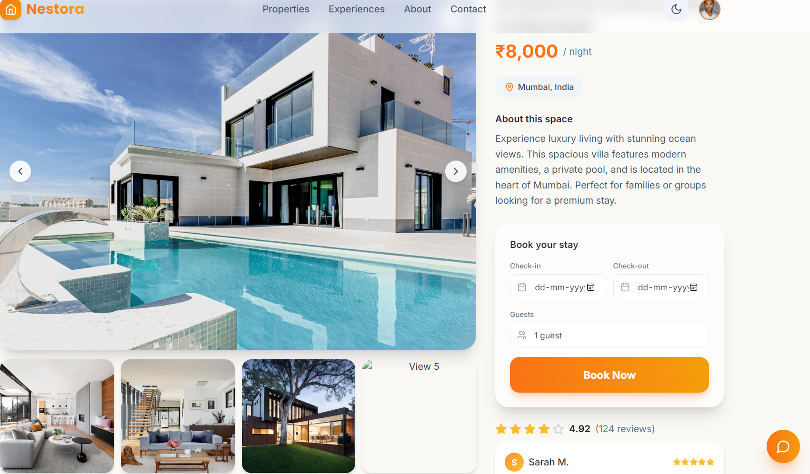
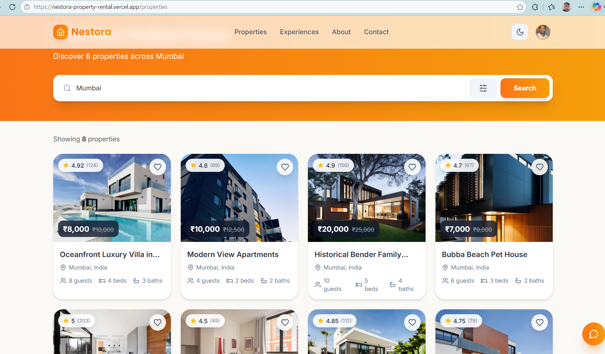
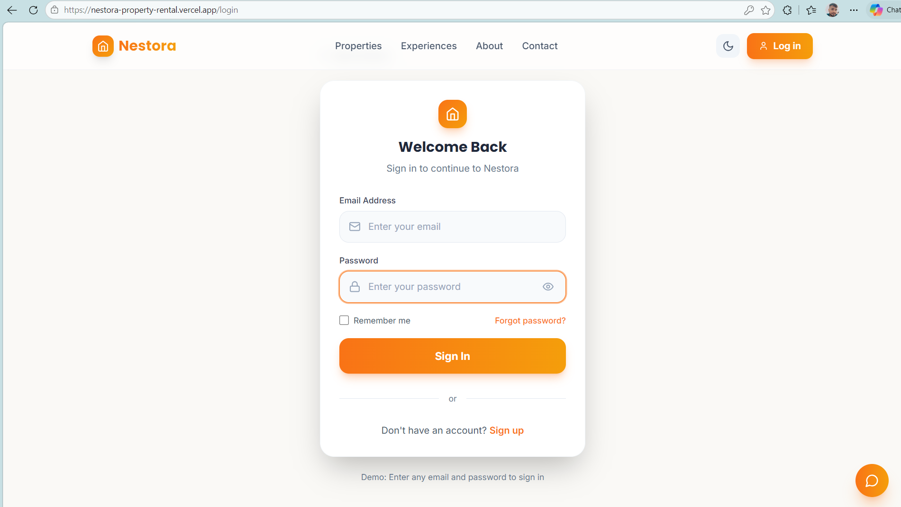

# 🏠 Nestora – AI-Powered Property Rental Platform

## 🤖 Agentic AI Rental Assistant

Nestora is a full-stack property rental platform enhanced with an **Agentic AI Rental Assistant** that can understand a user's rental goal, dynamically select actions, execute a multi-step search workflow, evaluate results, verify availability, and adapt when constraints or availability change.

### 🚀 Live Demo

**[Try Nestora Agentic AI Live](https://nestora-property-rental-1.onrender.com)**

### 💻 Source Code

**[GitHub Repository](https://github.com/AnushkaBharti2/-Nestora-property-rental)**

---

## 🧠 What Makes Nestora Agentic?

Unlike a conventional chatbot that only generates text, the Nestora Agent works toward a user-defined rental goal by performing a sequence of actions.

### Agent Workflow

**User Goal → Decision → Tool Selection → Action → Intermediate Result → Adaptation → Final Recommendation**

The agent can:

- Understand natural-language rental requirements
- Identify constraints such as budget, location, furnishing and parking
- Search the property inventory
- Retrieve property details
- Check property availability
- Rank matching properties
- Shortlist a selected property
- Adapt its plan when a preferred property is unavailable
- Return an explainable recommendation with the reasoning behind the selection

---

## ⚡ Example Agent Execution

### User Goal

> Find me a furnished 1BHK in Bangalore under ₹25,000 near Electronic City with parking.

### Agent Execution

**1. Goal Understanding**  
Extracts the user's requirements:
- Location: Electronic City
- Configuration: 1BHK
- Budget: ≤ ₹25,000/month
- Furnishing: Furnished
- Parking: Required

**2. Dynamic Action Selection**  
The agent determines that it needs to:
- Search properties
- Rank matching properties
- Verify availability

**3. Property Search**  
The agent searches the available property inventory and identifies relevant candidates.

**4. Verification**  
The agent checks availability before presenting the recommendation.

**5. Ranking**  
Properties are evaluated against the user's constraints to identify the strongest match.

**6. Final Outcome**  
The agent returns the best available property and explains why it fits the user's requirements.

---

## 🔄 Adaptive Agent Behavior

Nestora also demonstrates adaptation when an expected result changes.

For example, if the highest-ranked property is unavailable, the agent does not simply stop or return the unavailable property.

Instead, it:

**Detects unavailable property → Re-evaluates candidates → Selects an alternative → Verifies availability → Returns updated recommendation**

This demonstrates **goal-driven, multi-step and adaptive behavior** rather than simple text generation.

---

## 🛠️ Agent Tools

The Nestora Agent currently operates through the following tools:

| Tool | Purpose |
|---|---|
| `search_properties` | Searches properties using user constraints |
| `get_property_details` | Retrieves detailed information about a property |
| `check_availability` | Verifies whether a property is available |
| `rank_properties` | Scores and ranks candidate properties |
| `shortlist_property` | Adds a selected property to the user's shortlist |

---

## 🏗️ Architecture

```text
                    ┌──────────────────────┐
                    │      User Goal       │
                    │ Natural Language     │
                    └──────────┬───────────┘
                               │
                               ▼
                    ┌──────────────────────┐
                    │    Nestora Agent     │
                    │ Goal Interpretation  │
                    │ Planning & Decisions │
                    └──────────┬───────────┘
                               │
                  ┌────────────┼────────────┐
                  ▼            ▼            ▼
           Search Tool   Details Tool   Availability
                  │            │            │
                  └────────────┼────────────┘
                               ▼
                    ┌──────────────────────┐
                    │   Candidate Ranking  │
                    └──────────┬───────────┘
                               │
                               ▼
                    ┌──────────────────────┐
                    │   Adaptation Layer   │
                    │ Re-plan if needed    │
                    └──────────┬───────────┘
                               │
                               ▼
                    ┌──────────────────────┐
                    │ Final Recommendation │
                    └──────────────────────┘

# Screenshots

### Home Page



### Property Details Page



### AI Assistant Chat Feature


### Login Page



---

# Project Structure

```
house-rent-app
│
├── server
│   ├── config
│   ├── models
│   ├── routes
│   ├── middleware
│   ├── controllers
│   ├── socket
│   └── server.js
│
├── client
│   ├── src
│   │   ├── components
│   │   ├── pages
│   │   ├── context
│   │   ├── hooks
│   │   ├── utils
│   │   └── App.jsx
│   └── package.json
│
└── README.md
```

---

# Getting Started

## Prerequisites

Make sure the following tools are installed:

* Node.js (v14 or above)
* MongoDB (Local installation or MongoDB Atlas)
* npm or yarn

---

# Installation

### Clone the Repository

```
git clone https://github.com/AnushkaBharti2/Nestora-property-rental.git
```

### Install Backend Dependencies

```
cd server
npm install
```

### Install Frontend Dependencies

```
cd client
npm install
```

---

# Environment Variables

Create a `.env` file inside the **server** folder.

```
PORT=5000
MONGODB_URI=your-mongodb-uri
JWT_SECRET=your-secret-key
JWT_EXPIRE=7d

CLOUDINARY_CLOUD_NAME=your-cloud-name
CLOUDINARY_API_KEY=your-api-key
CLOUDINARY_API_SECRET=your-api-secret

CLIENT_URL=http://localhost:5173
```

---

# Running the Application

### Start Backend Server

```
cd server
npm run dev
```

### Start Frontend Client

```
cd client
npm run dev
```

Open your browser and go to:

```
http://localhost:5173
```


Each member contributed to different parts of the application including frontend development, backend APIs, database integration, testing, and deployment.

---
💡 Key Agentic AI Capabilities
Goal-Driven Execution

The agent works toward the user's rental objective rather than generating a generic response.

Dynamic Action Selection

The agent decides which tools/actions are required based on the user's request.

Multi-Step Execution

A single request can trigger multiple sequential operations such as searching, ranking and availability verification.

Adaptation

When a property becomes unavailable or constraints change, the agent can reconsider the available candidates and produce an updated plan.

Explainability

The interface exposes the agent's activity, including the goal, actions performed, results and adaptation.

🧰 Technology Stack

Frontend

React
Vite
Tailwind CSS

Backend

Node.js
Express.js

Agentic AI

Google Gemini
Tool/function-based agent workflow
Session-based agent state

Database / Data Layer

MongoDB/Mongoose for the original rental platform
Self-contained property inventory for the hackathon demonstration

Other Technologies

JWT Authentication
Socket.io
Cloudinary
# Project Purpose

This project demonstrates the development of a **full-stack MERN application** implementing authentication, role-based access control, property listing management, booking workflows, and real-time communication using Socket.io.
---

## 👩‍💻Author

**Anushka Bharti**
